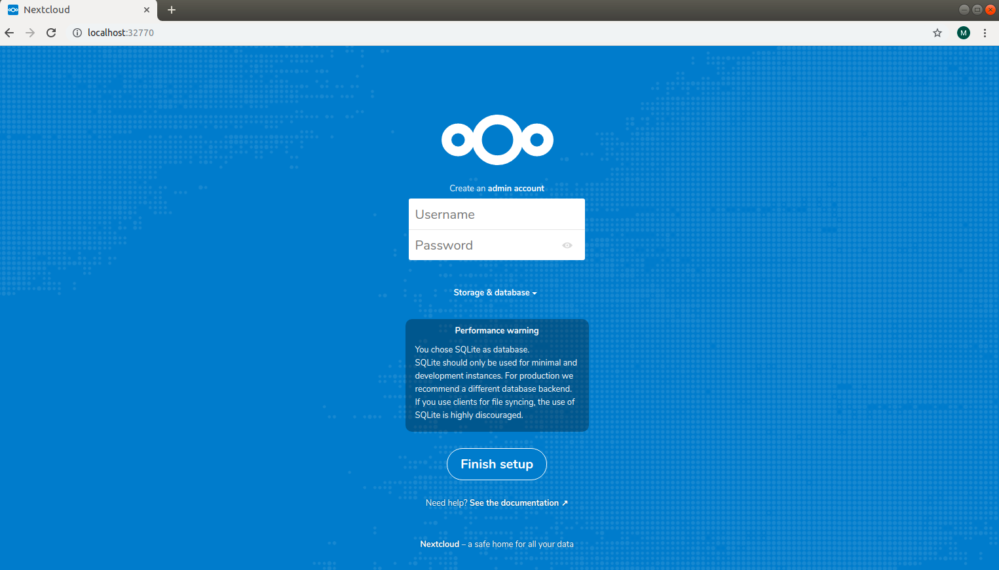
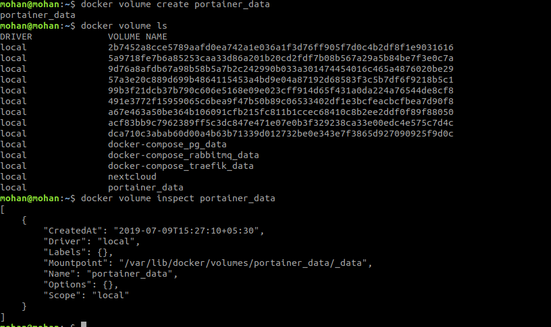
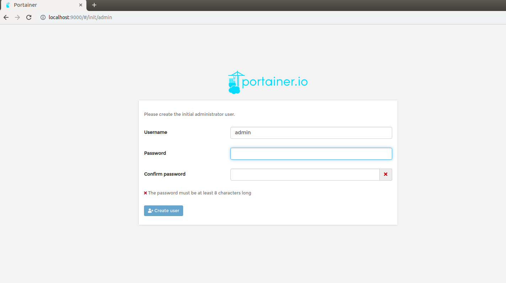

# Lab: Getting started with docker
---
In this lab, you will learn

  * How to launch containers with docker
  * Common options used with docker container run command
  * Run web applications and access those with port mapping  and
  * Learn how to manage container lifecycle and to debug those.

###  Launching your first container

Begin by checking the  version of docker installed with,

```
docker version
```

you could further validate docker by running a smoke test as,

```
docker run hello-world
```

This should launch a container successfully and show you hello world message.


Before you begin launching your first container, open a new terminal and run the following command to analyze the events on the docker daemon side.

```
docker system events
```

When you launch the above command, you may not see anything. Keep that window open, and it would start streaming events as you proceed to use docker cli further.


Now launch your first  container using following command,

```

docker container run centos ps

```

Where,

  * docker is the command line client
  * **container run**  is the command to launch a container. You could alternately use just **run** command here
  * centos is the image
  * ps is the actual command which is run inside this container.


Next go ahead and try creating a few more containers with different commands as,

```
* docker container run centos uptime
* docker container run centos uname -a
* docker container run centos free
```

you could check the events in the window where you have started running  `docker system events` command earlier. It shows whats happening on docker daemon side.


###  Listing Containers


you can check your last run container using following commands,

```
* docker ps -l
* docker ps -n 2
* docker ps -a
```

where
  * -l : last run container
  * -n xx : last xx number of containers
  * -a : all containers (even if they are in stopped state )


### Learning about images

Containers are launched using images, which are pulled from registry. Observe following command,

 ```
 docker container run centos ps
 ```
 Here the image name is **centos** which can actually expanded to

`registry.docker.io/docker/centos:latest`

where following are the fields,

  * registry: registry.docker.io
  * namespace: docker
  * repo: centos
  * tag: latest


You could use below commands to list your images from your local machine and pull the image from docker-hub.Even you can get the history about image by using your image name or image id.


```
docker image ls

docker image pull nginx/nginx-prometheus-exporter:0.2.0

docker image history nginx/nginx-prometheus-exporter:0.2.0
```


### Default run options


 you already know how to run a container,but here you will learn how to run a container in the background using default run options.

```
docker run -it centos bash
```

You could use below command while creating your container, it will remove your container once you stopped it.

```
 docker run --rm -it alpine sh
```

If you need to run your container always in background, you can use `-d` option, it will run your container in detach mode and you will name your container by using `--name` while creating your container.

```
docker container run -idt --name redis redis:alpine
```

### Accessing web apps with port mapping :-

Once you create a docker container for your application,then accessing that application on browser you need to mapp application port with our localhost port.

```
 docker container run -idt -p 8080:80 nginx
```

 once you done the port mapping, access that application on your browser by visiting

   `http://localhost:8080`


Above you used purticular port for port map with `-p`, but you can also use  automatic port mapping by using `-P` while you create your container.

```
docker container run -idt -P nginx
```

once you create a container, you need port to access that app, for that use `docker ps -l` you will get mapped port.

`Example:-` you can access your application on `localhost:32769`.


### Troubleshooting containers

Here you will learn how to check log and troubleshoot containers by using below commands.

find your container id or container name using

```

docker ps

```

You could use below command to find out logs for a container whose name is redis.

```
 docker logs redis

```

Try replacing **redis** with the container id as well. That should work too.


you can follow the logs using `-f` option and `docker exec` allows you to run a command inside a container.


```
 docker logs -f redis
```


**exec** command allows you connect to the container and launch a shell inside it, similar to a ssh connection. It also allows running one off commands.


```
  docker exec redis ps
  docker exec -it redis sh

```

You learnt about **logs** and **exec** commands which are esssential for debugging a container.


### Exercise:  Setting up nextcloud

 Previously you have some understanding about running application using containers, here you will setup nextcloud application using official image with creating volume and mounting inside the container.

 You just follow the below procedure to Setting up nextcloud.
 ```
 docker container run -idt -P -v nextcloud:/var/www/html nextcloud
 ```
 

 Use below commands to get running container port and logs.
 ```
 * docker ps
 * docker logs ac69
 * docker logs -f ac69
 ```
 `Example:` you can visit the application buy using `localhost:32770` on your browser.
 

### Portainer with advanced run option
Here you will launch and practice more advanced run option by using portainer application.

Firts you need to create a volume before running a container and validate the volume by using below commands.
```
* docker volume create portainer_data
* docker volume ls
* docker volume inspect portainer_data
```


 After creating the volume you just run the `docker run` command along with the volume which we are created.
 ```
 docker run -d -p 9000:9000 -v /var/run/docker.sock:/var/run/docker.sock -v portainer_data:/data portainer/portainer
 ```
Once you created your container, then access the portainer application using port 9000 on your browser.

 `example:- localhost:9000`

### Stop, remove and cleanup :-
Here you will learn how to stop, remove and cleanup the containers which you have created.

Find your container id and stop the container before you are going to remove and you can pause and unpause the container as well.
```
* docker ps
* docker pause ac69
* docker unpause ac69
* docker stop b584
* docker stop b584 84e6 e4da
```
you can remove or again start the container once it stopped.
```
* docker start redis
* docker rm -f b584
```
you could remove the images which ever you want and you can also delete all the stopped containers and dangling images by using below commands.
```
* docker image rm 4206
* docker image rm 4f1 4d9 4c1 9f3
* docker system prune
```
You could get all your docker system information by using `docker system info`.
