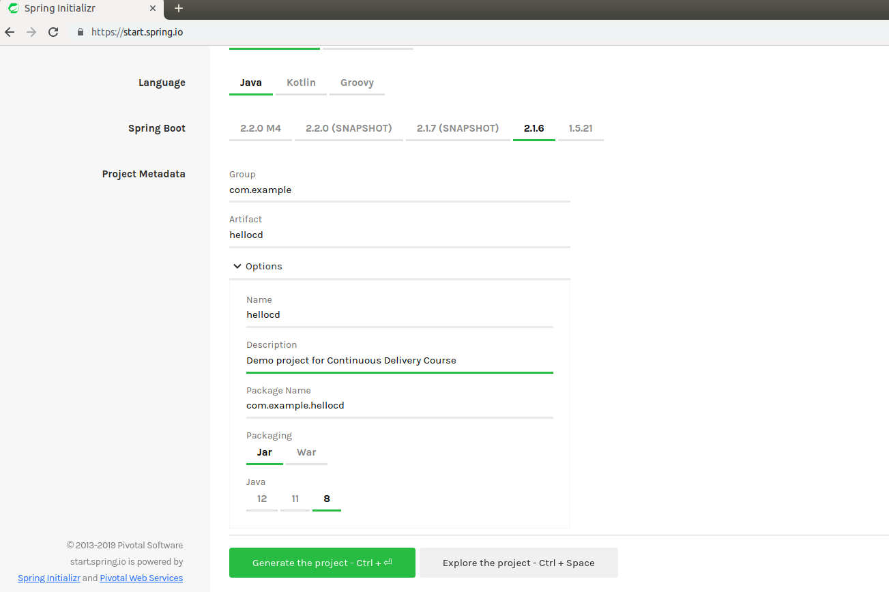

# Revision Control with Git
In this lab, you will learn how to configure git and the complete work flow of git like, three trees of git and how to simplyfy development by using branch based development. you will also learn merging to master branch,collaborating and syncing changes with remotes.This will help you to get good understanding about revision control.
### Configuring git client :-
Before you are start revision control, you need to configure git.There are three different places you can configure git, that are explained here and you just follow below method to configure git.

Git configs:-
```
* USER -->  .git/config
* USER -->  /home/user/.gitconfig
* HOST -->  /etc/gitconfig
```
Here you will configure git globally to your specific USER.
```
* git config --global user.name "username"
* git config --global user.email "user@gmail.com"
* git config -l
* cat ~/.gitconfig
```
You could use editor for git configuration.
```
* git config --global core.editor vim
* git config -l
* git config -e --global
```
Here you will create a simple hello-world application using java based spring boot framework.To create the application visit [startspringboot](https://start.spring.io/).

Once you vist that page, change your artifact name and description. Click Generate the project to download your application.

After downloaded your application, move that zip file to your ci-cd directory and unzip that application. you will use this application for revision control operations and writing simple web application.  
```
unzip hellocd.zip
```
### Basics of revision control :-
you already have a hellocd application on your ci-cd directory, you are going to use that application for this revision control operations.

first you will check your git status but you don't have a git repository for this application, so you need to initialize git repository and check your status.
```
* git init .
* git status
```
Once you check git status it will show untracked files, so you need to add the files to upload your git repo by using add and commit.you could use below commands to git add,commit ,status and git logs.once you are using git commit it will open editor and add your commit message over there.
```
* git add pom.xml
* git commit
* git status
* git add src
* git add *
* git commit mvnw
* git commit -am "adding files created with spring boot generator"
* git log
```
### Three trees of git-Working,staging,commit :-
Previously you are added and commited all files using git command, now you are going to learn about three trees of git.

Once you are in your working directory, you added the file to staging area and then you commited that file to commit tree.we added picture below for your best understanding.


git logs will shows you commit history and git status show you new file or untracked file in your directory. you just add one more file in your working directory `README.md`and then check your git status after that commit that using reset.
```
* git add README.md
* git status
* git reset README.md
* git add README.md
* git commit -am "adding README"
```
In this you have added and commited the files one by one, that flow chat is given below and this is the current state of your repository.

### Using docker in development :-
You have a java project based on maven, now you are going to build this by using mvn build tool. you don't need to install maven on your local environment, you could use a container for this with source code volume.

Use the below command to run the container, before that you need absolute path for source code, for that use `pwd` commad for finding your absolute path.  
```
docker container run --rm -it -v /Users/gouravshah/learn/ci-cd/hellocd:app maven:alpine sh
```
Once you run the above command, you will get shell and run given below maven spring boot command.
```
* mvn spring-boot:run -f app/pom.xml
```

Once you run `mvn spring-boot:run -f app/pom.xml` it will take few minues to finish the buid and you will get below screen,

you could see your libraries are stored in `/root/.m2/` directory. you can reduce the time to download libraries by creating and adding one more volume `m2` while running container.
```
* docker volume create m2
* docker container run --rm -it -v m2:/root/.m2 -v /Users/gouravshah/learn/ci-cd/hellocd:app maven:alpine mvn spring-boot:run -f /app/pom.xml
```
you could run `docker cntainer run` again and again after created `m2` volume, it will speed up your process.
### Getting started with branching :-
